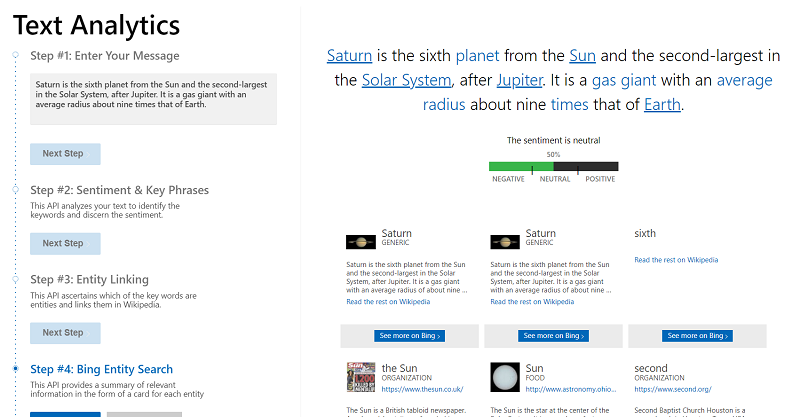

# M03 DEMO #1

- Text Analytics

This code is provided for demo purposes only for course AI-102.

### Requirements
- Azure Subscription
- .Net core 3.1
- VS Code or VS 2019

## Text Analytics

1. Follow the [link](https://aidemos.microsoft.com/text-analytics) to observe step by step vizard of analyzing default sentences. As a result of analyzing you will get sentiment and key phrases detected, entities will be linked to corresponding Wiki pages. Finally the bing entity search will find for you articles for each detected entity.

