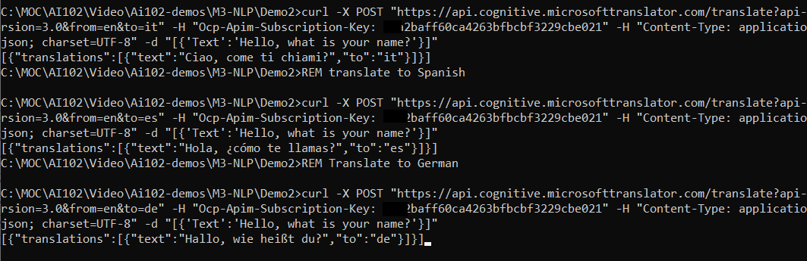

# M03 DEMO #2

- Translate Text
- Integration with Bot service

This code is provided for demo purposes only for course AI-102.

### Requirements
- Azure Subscription
- .Net core 3.1
- VS Code or VS 2019

## Translate Text

1. Open file 'translate.bat' and update command with your multi-service cognitive service subscription key. The value should follow `Ocp-Apim-Subscription-Key:` without quotes. The origin language is English and translation will be provided in the short name of the language in "to" parameter.

