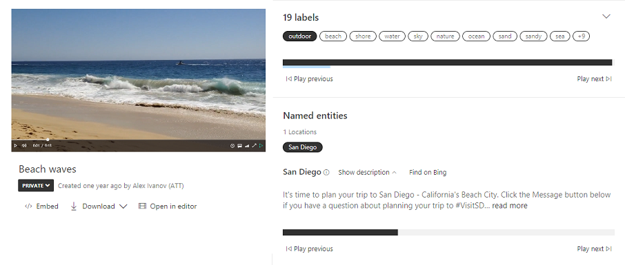

# M08 DEMO #2

- Video Analyzer

This code is provided for demo purposes only for course AI-102.

## Requirements
- Azure Subscription
- Net 5
- VS Code or VS 2019

## Video Analyzer

1. General capabilities of Video Analyzer introduced in the following [tour](https://vi.microsoft.com/en-us/tour)

1.  To index your own video you need to open the Video Analyzer portal https://www.videoindexer.ai/ and sign in with your subscription account.

1. You can upload the short video from the local folder beach-waves.mp4 and get the result of analyzing:

    - tags
    - locations
    - transcript
    - sentiment
    - key frames

    
